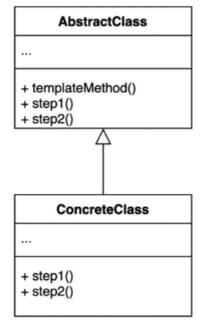
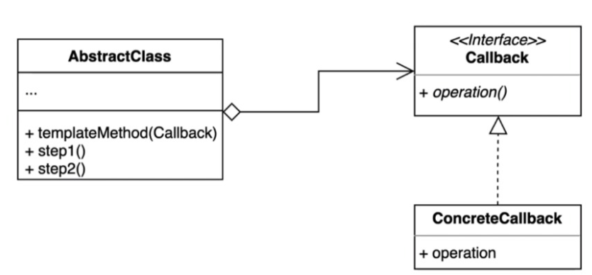

> ### 행동 관련 디자인 패턴

## 템플릿 패턴 ( Template Pattern )

---

알고리즘 구조를 서브 클래스가 확장할 수 있또록 템플릿으로 제공하는 방법.
> 추상 클래스는 템플릿을 제공하고 하위 클래스는 구체적인 알고리즘을 제공한다. 
> 
> 특정한 단계를 하위클래스에서 재 정의 하게끔 추상 메서드로 빼서 템플릿 메서드 안에서 호출하는 구조로 제공 
 
 

### > Template Callback 패턴
> 콜백으로 상속 대신 위임을 사용하는 템플릿 패턴
> 
> 상속 대신 익명 내부 클래스 또는 람다 표현식을 활용할 수 있다. ( 장점 )

클래스가 늘어나지도 않고 위임을 통해수 거현하게 되어서, 원하는 형태로 작성하여 사용 가능, 만약 다른 메소드에서도 해당 부분을 상요하게 된다면
해당 부분을 상속받아 class로 작성해도 된다.

---

템플릿 메소드 패턴의 장,단점

장점

 - 템플릿 코드를 재사용하고 중복 코드를 줄일 수 있다.
 - 템플릿 코드를 변경하지 않고 상속을 받아서 구체적인 알고리즘만 변경할 수 있다. ( 예제에서는 getResult 부분 )

단점

 - 리스코프 치환 원칙을 위반할 수도 있다.
   - 만약 process의 역할을 override해서 이상하게만들면 ... 
   - final을 사용하여 상속을 막을 수 있지만, getResult 에서 이상한 로직을 작성해버리면 언제든지 해당 원칙이 깨질 수 있다.
 - 알고리즘 구조가 복잡할 수록 템플릿을 유지하기 어려워진다.
   - 다양하게 바꿀수 있도록 허용해주는 부분이 많아질수록 기존 코드가 복잡해질수있는 가능성이 높음

------

Java, Spring에 적용된 Template 패턴 

Java
 - HttpServlet 
   - doGet, doPost 등등 

Spring
> 우리가 흔히 사용하는 Configuration에서 @Override하는 부분들을 의미 
  - ConfigurerAdapter
    - configure 일부 메서드 
  - JdbcTemplate
    - execute()를 사용해서 sql을 실행하는데 해당 부분
    - JdbcTemplate 의 경우 TemplateCallback 으로 구현되있음.
  - RestTemplate 도 TemplateCallback 패턴으로 구현되어 있음.
