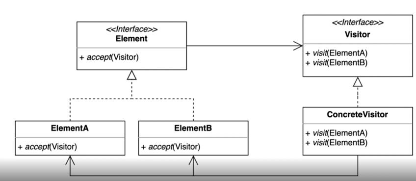

> ### 행동 관련 디자인 패턴

## 방문자 패턴 ( Visitor Pattern )

---

기존 코드를 변경하지 않고 새로운 기능을 추가하는 방법. 

 - 더블 디스패치 (Double Dispatch)를 활용할 수 있다.

### ⭐ Visitor
> 강의 에서 나오는 Device interface 를 의미 

### ⭐ ConcreteVisitor
> Phone, Watch와 같은 Device interface를 상속받아서 구현한 클래스를 의미.

### ⭐ Element
> accept 메서드를 가지고 있는 interface인 Shape 를 의미

### ⭐ ElementA, ElementB
> accept 를 구현한 구현체인 Circle, Rectangle을 의미 

---

### ⭐ 방문자 패턴의 장단점

장점 

 - 작업 대상과 작업 항목을 분리시킬 수 있다 .
 - accept라는 인터페이스를 통일 시키기 대문에 동일한 인터페이스 제공 가능 .

단점

 - Visitor와 Element간의 결합도가 높아진다. 

---

### ⭐ 자바와 Spring에 적용된 방문자 패턴

Java

 - FileVisitor, SimpleFileVisitor
 - AnnotationValueVisitor
 - ElementVisitor

스프링
 - BeanDefinitionVisitor
