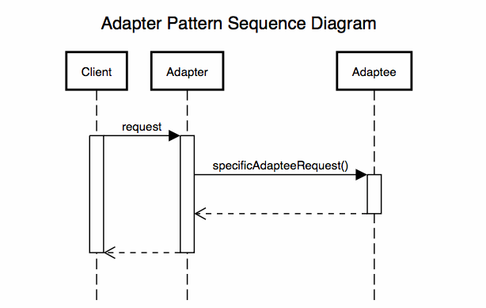

## 어댑터 패턴

---

> 기존 코드를 클라이언트가 사용하는 인터페이스의 구현체로 바꿔주는 패턴  
> 클라이언트가 사용하는 인터페이스를 따르지 않는 기존 코드를 재사용할 수 있게 해준다.

조금더 쉽게 정리해보면 서로 호환성이 없는 인터페이스때문에 함께 동작할 수 없는 클래스들이 함께 작동할 수 있도록 해주는 패턴이라고 보면 편하다.

### Client
써드파티 라이브러리나 외부 시스템을 사용하는 쪽을 의미

### Target
Adapter가 구현하는 인터페이스이며, Client는 해당 Target Interface를 통해 Adaptee인 써드파티 라이브러리를 사용한다.

> 강의해 해당하는 UserDetail 과 UserDetailService가 Target에 해당된다.

### Adaptee
써드 파티 라이브러리나 외부 시스템을 의미

> 우리의 어플리케이션에서 구현하는 Account와 AccountService가 Adaptee에 속하게 된다.

### Adapter
Client와 Adapter 중간에서 호환성이 없는 둘을 연결시켜주는 역할을 담당. 
Target Interface를 구현하며, Client는 TargetInterface를 통해 어댑터에 요청을 보낸다.
클라이언트의 요청을 Adaptee가 이해할 수 있는 방법으로 전달하고 처리는 Adaptee가 진행한다.

> Adapter 부분을 직접 구현 ( 이놈이 핵심이지 않을까? )  

---

### Adapter의 장단점

Adapter 패턴을 구현하는 방식으로는 추가적인 Adapter클래스를 생성하는 방식과, Target interface를 Adaptee에서 직접 구현하는 방식이 있다.

만약 Adaptee를 직접 수정할 수 있다면 Adaptee에서 직접 상속받아 구현할 수 있다.

하지만 해당 Target Interface를 Adaptee가 직접 구현하게 된다면 단일책임원칙의 입장에서보게 된다면 위배하게되어 번거롭겠지만
추가적인 adapter class를 생성하는것을 추천한다.

---

## 어댑터 패턴의 호출 과정

> Client에서 Target Interface를 호출하는것처럼생각할 수 있으나 Target Interface를 구현한 Adapter를 호출하게되고 해당 Adapter에서는 자신이 감싸고 있는 Adaptee에게 실질적인 처리를 위임한다.
> 
> 조금 더 찾아보니 Adapter가 Adaptee를 감싸고 있는 것 때문에 Wrapper 패턴이라고도 불린다.

--
