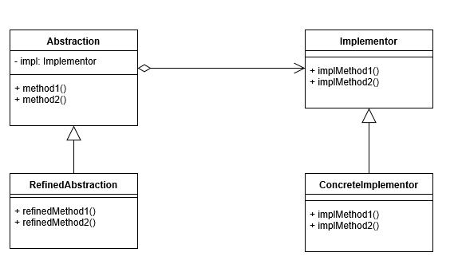

## 브릿치 패턴

---

> 추상적인 것과 구체적인 것을 분리하여 연결하는 패턴 
> 구현으로부터 추상레이어를 분리하여 이 둘이 서로 독립적으로 변화할 수 있도록 한다.
> ex) 프론트와 백엔드, GUI와 API

####Abstraction 
 - 기능 계층의 최상위 클래스이며 추상 인터페이스를 정의한다 
 - 구현 부분에 해당하는 클래스 인스턴스를 가지며, 해당 인스턴스를 통해 구현부분의 메소드를 호출한다. 
Champion 와 Champion 인터페이스를 구현한 DefaultChampion 을 의미

RefinedAbstraction
 - Abstraction에 의해 정의된 인터페이스를 확장한다.
 - 기능 계층에서 새로운 부분을 확장한 클래스를 의미

DefaultChampion 클래스를 확장받은 클래스인 다른 캐릭터들의 class를 의미 

Implementor 
 - 구현 클래스를 위한 인터페이스를 정의한다.

해당 강의에서는 Skin Interface 를 의미 

ConcreateImplementor
 - Implementor 인터페이스를 실제 구현한 클래스를 의미

해당 강의에서는 Skin을 구현한 KDA Skin class를 의미

---

### 브릿지 패턴의 장단점

장점 
 - 추상적인 코드를 구체적인 코드변경 없이 독립적으로 확장이 가능. (OCP 원칙을 달성)
 - 추상적인 코드와 구체적은 코드를 분리할 수 있다.

단점
 - 계층 구조가 늘어나 복잡도가 증가할 수 있다.

### 자바와 스프링에서의 브릿지 패턴
 - Java의 Connection, Statement, ResultSet들이 해당된다.
 - Slf4j ( 보는 관점에 따라 다를 수 있음. )