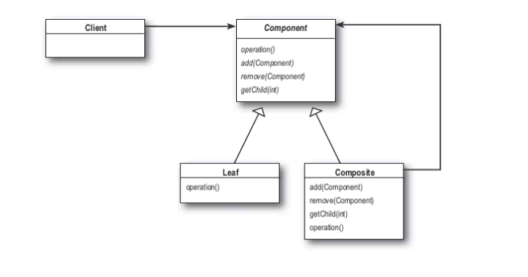

## 컴포지트 패턴

---

그룹 전체와 개별 객체를 동일하게 처리할 수 있는 패턴 ( 계층 구조를 만든다)

Composite패턴에서는 절대 Leaf를 참조하면안된다. Component를 참조해야함.

### Component
 - 구체적인 부분을 의미
 - Leaf클래스와 전체에 해당하는 Composite 클래스에 공통 인터페이스를 정의

https://gmlwjd9405.github.io/2018/08/10/composite-pattern.html

### 컴포지트 패턴 장단점

장점
 - 복잡한 트리구조를 편리하게 사용 가능
 - 다형성과 재귀 활용 가능
 - 클라이언트 코드를 변경하지 않고 새로운 엘리먼트 타입을 추가 가능
 - OCP 가능

단점
 - 트리를 만들어야 하기 때문에 지나치게 일반화 해야하는 경우가 생길 수 있다.
 - OCP를 만족하지 못한다.