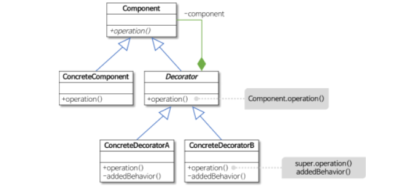

## 데코레이터 패턴

---

데코레이터패턴은 기존 코드를 변경하지 않고 부가 기능을 추가하는 패턴을 의미한다.<br>
또한 객체에 책임을 동적으로 추가하는 패턴을 의미한다.

상속이 아닌 위임을 사용해서 보다 유연하게(런타임에) 부가 기능을 추가하는것이 가능하다.




기본 기능에 추가할 수 있는 기능의 종류가 많아질 수록 각 추가기능을 Decorator 클래스로 정의한 후 필요한 Decorator 객체를 조합함으로써 추가 기능의 조합을 설계하는 방식이다.

### Component
> 기본 기능을 뜻하는 ConcreteComponent 와 추가 기는을 뜻하는 Decorator 공통 기능을 정리한 Interface 를 의미 

---

대략적인 사용 방법

```java
public interface Component {
  String add();
}

public class BaseComponent implements Component {
  @Override
  public String add() {
    return "Base";
  }
}

//감싸고 있는 데코레이터는 호출만해주면된다.
public class Decorator implements Component {
  private Decorator decorator;

  public FirstComponent(Decorator decorator) {
    this.decorator = decorator;
  }

  @Override
  public String add() {
    return super.add();
  }
}

public class FirstComponent implements Decorator {

  public FirstComponent(Decorator decorator) {
    super(decorator);
  }

  @Override
  public String add() {
    return super.add() + " First";
  }
}

public class SecondComponent implements Decorator {

  public SecondComponent(Decorator decorator) {
    super(decorator);
  }

  @Override
  public String add() {
    return super.add() + " Second";
  }
}

// 호출 방식
public static void main(String[] args) {
  Component baseComponent = new BaseComponent(new FirstComponent(new SecondComponent()));
  System.out.println(baseComponent.add());
}

```


---


### 데코레이터 패턴 장단점

장점
 - 새로운 클래스를 만들지 않고 기존 기능을 조합할 수 있다.
 - 2가지 이상의 기능을 만들기 위해 하나의 새로운 조합클래스를 만들 필요가 없다.
 - 컴파일 시점이 아닌 런타임 시점에 동적으로 기능을 확장할 수 있다. 

단점
 - 데코레이터 코드가 늘어날수록 더 복잡해 질 수 있다.